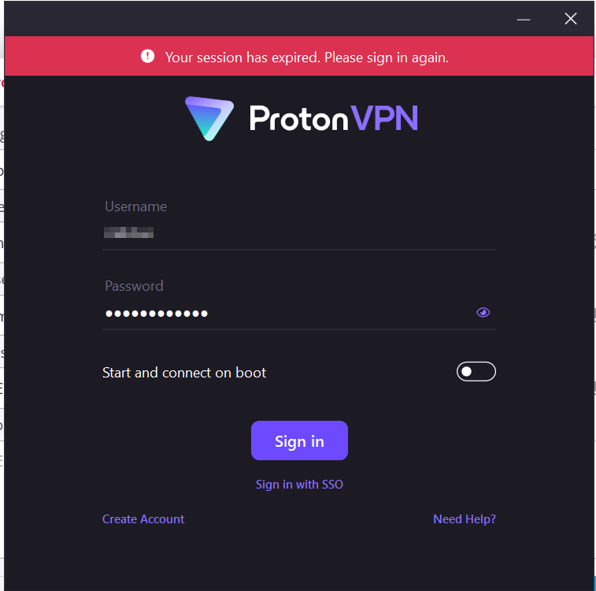

# VPN Field Report – Privacy & Encryption in Action

### 🎯 Objective:

Explore how VPNs help hide identity and protect traffic. See what changes, what breaks, and what improves.

---

## 🔧 Setup Log

**Chosen VPN**: ProtonVPN (Free Tier)

**Why**: Known for strict no-log policy, OpenVPN support, and relatively decent speeds even on the free plan.

**System**: Windows 11

**Browser**: Firefox (uBlock Origin + HTTPS Everywhere already installed)

---

## 🛠️ Deployment Steps (Logged)

**[✓] Step 1: Registered**

- Email used: burner.
- Signup successful.
- Proton dashboard doesn’t ask for payment (free plan verified).

**[✓] Step 2: Download + Install**

- Installer downloaded from [official ProtonVPN site]
- 35MB size, SHA256 matched — verified
- Installed smoothly, no system reboots required

**[✓] Step 3: Login + Connect**

- Logged in using free credentials
- Connected to "Netherlands-FREE#1"
- Latency ~112ms
- Status: ✅ Connected

---

## 🕵️ IP Check

**Site Used**: `whatismyipaddress.com`

- Before VPN: `157.xxx.xx.xx` → shows India
- After VPN: `149.xx.xx.xx` → Netherlands ✅

---

## 🚦 Browsing Behavior

**With VPN ON:**

- YouTube: buffers more
- Medium.com: accessible
- No captchas triggered — Proton seems to have clean exit IPs

**With VPN OFF:**

- Speed returns to normal
- IP back to ISP range
- Noticed more regional ads (local language ones)

---

## VPN Breakdown:

### Benefits Noticed

- IP shift is instant — masking works
- Useful on public Wi-Fi or while torrenting (Proton blocks P2P on free, though)
- No logs, no DNS leaks
- Great for bypassing country-level restrictions

### Limits

- Speed drop ~30-40% (especially on peak hours)
- Free plan has limited server availability — can’t always choose US
- Doesn’t block phishing/malware unless paired with other tools
- Not anonymous: VPN provider **can** see traffic if they want

---

## 🧾 Conclusion

Using ProtonVPN gave a firsthand look at how tunneling changes everything — from IP to perceived location to data routes. Encryption is solid, and it's a no-brainer for securing traffic on unsafe networks. That said, it’s no silver bullet: it’s a **privacy layer**, not a magic cloak.